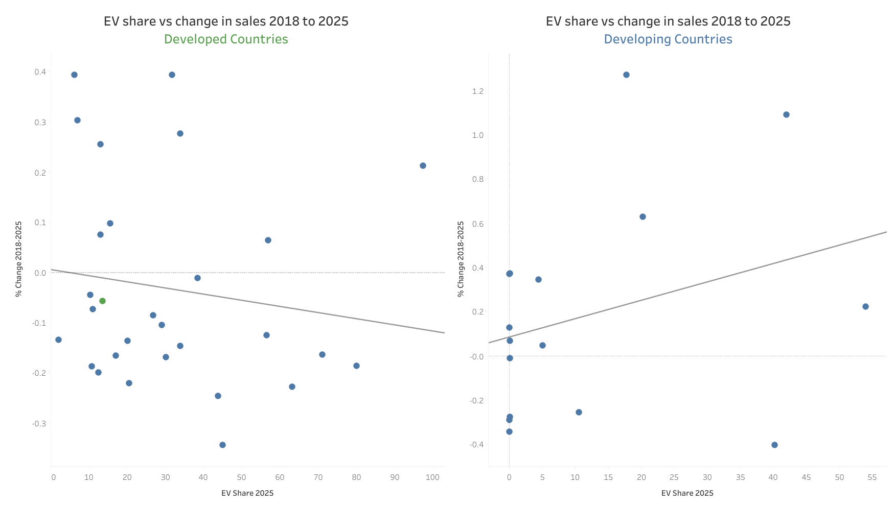
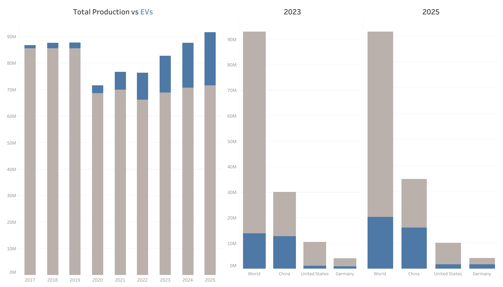
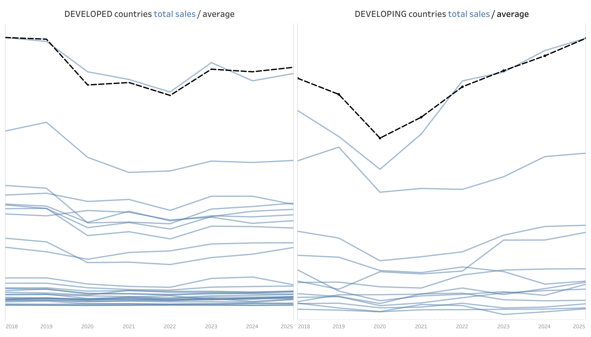
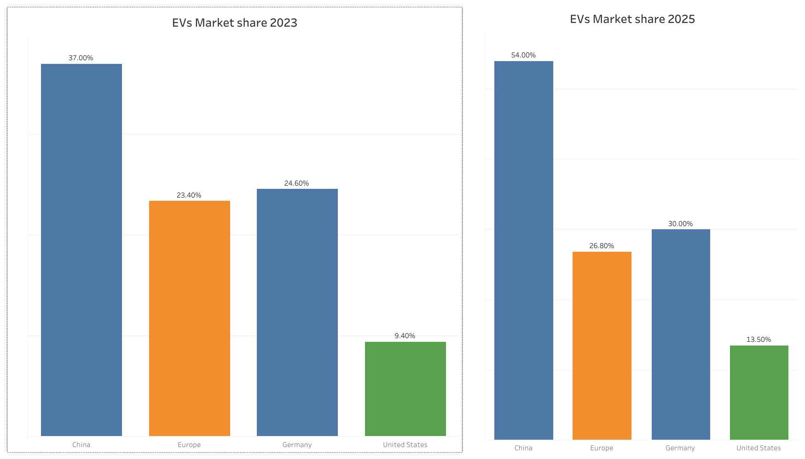

# Global Automotive Industry Analysis: EV Adoption & Market Shifts

This project analyzes how **Plug-in Electric Vehicle (PEV)** adoption intersects with broader vehicle sales and production trends across countries. The central question is whether early EV adoption in developed markets may have pulled demand forward and contributed to a softer near-term replacement cycle.

---

## Table of Contents
1. [Project Overview](#1-project-overview)
2. [Getting Started](#2-getting-started)
   - [Prerequisites](#prerequisites)
   - [Installation](#installation)
3. [Project Structure](#3-project-structure)
4. [Methodology](#4-methodology)
5. [Reproducing the Analysis](#5-reproducing-the-analysis)
6. [Hypotheses and Conclusions](#6-hypotheses-and-conclusions)
7. [Data Sources](#7-data-sources)
8. [Contributing](#8-contributing)
9. [License](#9-license)

---

## 1. Project Overview
The project combines scraped public data, manual cleanup, and notebook-based processing to build a country-level view of:
- vehicle production,
- EV market share,
- EV sales,
- vehicle ownership per capita, and
- vehicle trade balances.

The aim is not merely to track EV growth, but to examine whether adoption patterns align with broader shifts in automotive demand and replacement behavior.

## 2. Getting Started

### Prerequisites
- Python 3.10+
- Jupyter Notebook or JupyterLab
- Tableau Desktop or Tableau Public (optional, for dashboard exploration)

### Installation
1. **Clone the repository**
   ```bash
   git clone https://github.com/MarcusOvergaard/The-EV-Inflection.git
   cd The-EV-Inflection
   ```

2. **Create and activate a virtual environment**
   ```bash
   python -m venv .venv
   source .venv/bin/activate  # On Windows: .venv\Scripts\activate
   ```

3. **Install dependencies**
   ```bash
   pip install -r requirements.txt
   ```

## 3. Project Structure

```text
The-EV-Inflection/
├── assets/                     # Supporting files and archived legacy scripts
├── data/
│   ├── raw/                    # Source tables and scraped raw data snapshots
│   ├── interim/                # Manual corrections / enrichment tables
│   └── processed/              # Final cleaned tables used for analysis
├── notebooks/                  # Main notebook workflow
├── reports/figures/            # Static figures used in the README
├── src/                        # Canonical scraping and cleaning scripts
├── LICENSE
├── README.md
└── requirements.txt
```

### Notes
- `src/` contains the **canonical project scripts**.
- `data/interim/` stores manual patch files used to override or complete automated outputs.
- `assets/legacy_raw_scripts/` contains earlier helper scripts preserved for reference, but they are **not** the primary workflow.

## 4. Methodology
This project uses a practical hybrid workflow:

1. **Raw collection**  
   Source tables are collected from public references such as Wikipedia-based country lists and related automotive datasets.

2. **Automated cleaning**  
   Python scripts standardize headers, reshape wide tables into long format, and normalize values.

3. **Manual enrichment**  
   Gaps and inconsistencies are patched through curated files in `data/interim/`.

4. **Notebook consolidation**  
   The notebook `notebooks/01_data_cleaning_and_preparation.ipynb` merges automated outputs with manual corrections using `combine_first` logic.

5. **Visualization**  
   Final processed tables are used for exploratory analysis and Tableau-based charting.

## 5. Reproducing the Analysis
The repository is easiest to reproduce from the notebook-first workflow.

### Recommended path
1. Install dependencies from `requirements.txt`.
2. Review or refresh source tables inside `data/raw/` if needed.
3. Open:
   ```text
   notebooks/01_data_cleaning_and_preparation.ipynb
   ```
4. Run the notebook from top to bottom.
5. Confirm that final outputs are written to:
   ```text
   data/processed/Cleaned_Tables/
   ```

### Expected outputs
Running the notebook should produce cleaned versions of:
- `vehicle_production.csv`
- `ev_2.csv`
- `ev_3.csv`
- `vehicles_per_capita1.csv`
- `trade_data.csv`

### Workflow note
The current project treats the notebook as the main orchestration layer. The scripts in `src/` support the cleaning and scraping logic, while `data/interim/` contains manual overrides used during consolidation.

## 6. Hypotheses and Conclusions

### Testable Hypotheses
- **Socio-economic adoption curve:** higher-income and policy-supportive markets tend to adopt PEVs earlier.
- **Market saturation and cycle reset:** early EV adoption may front-load replacement demand, contributing to weaker near-term total vehicle sales growth in mature markets.

### Visual Findings
> **Interactive dashboard:** the higher-resolution dashboard is available on [Tableau Public](https://public.tableau.com/app/profile/marcus.timm).

#### Sales Trends vs. EV Market Share

*Developed countries with higher EV adoption rates show weaker sales performance since 2018 than many developing markets.*

#### Global Production Snapshots

*Comparison of total production volumes across the world, China, Europe, and the United States (2023-2024).* 

#### Total Sales & EV Growth
<p align="center">
  
  
</p>

### Working Conclusions
- **Replacement cycles:** EV adoption in wealthier markets may have pulled some purchases forward, reducing the urgency of near-term replacement.
- **Bifurcated market:** adoption remains uneven, with conventional vehicles still dominant across much of the world.
- **Investment lens:** short-term auto demand may look softer in saturated markets, while longer-term EV infrastructure and battery supply chains may still benefit from structural growth.
- **Context matters:** pandemic distortions, inflation, interest rates, and policy shifts remain important confounders and should be considered alongside the charts.

## 7. Data Sources
This repository uses public and third-party source material, including:
- Wikipedia country-level tables related to EV adoption, vehicle production, trade, and vehicle ownership
- OICA-related production references where applicable
- supplementary manually researched corrections used in the interim patch files

Please verify source pages, attribution requirements, and licensing terms before reusing the included data downstream.

## 8. Contributing
This is a personal analysis project, but constructive suggestions are welcome. If you spot a data issue, methodology problem, or clearer way to structure the workflow, feel free to open an issue or submit a pull request.

## 9. License
The code and original project materials are released under the [MIT License](LICENSE).

Third-party data sources remain subject to their own terms, licenses, and attribution requirements. See the LICENSE file for details.
